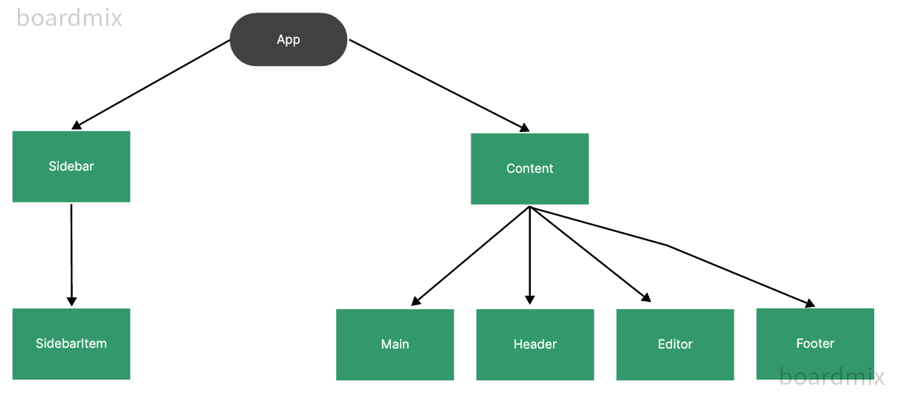

# 📌 5주차 프로젝트[Project1]

- [x] 글 단위를 Document라고 합니다. Document는 Document 여러개를 포함할 수 있습니다.
- [x] 화면 좌측에 Root Documents를 불러오는 API를 통해 루트 Documents를 렌더링합니다.
- [x] Root Document를 클릭하면 오른쪽 편집기 영역에 해당 Document의 Content를 렌더링합니다.
- [x] 해당 Root Document에 하위 Document가 있는 경우, 해당 Document 아래에 트리 형태로 렌더링 합니다.
- [x] Document Tree에서 각 Document 우측에는 + 버튼이 있습니다. 해당 버튼을 클릭하면, 클릭한 - Document의 하위 Document로 새 Document를 생성하고 편집화면으로 넘깁니다.
- [x] 편집기에는 기본적으로 저장 버튼이 없습니다. Document Save API를 이용해 지속적으로 서버에 저장되도록 합니다.
- [x] History API를 이용해 SPA 형태로 만듭니다.
- [x] 루트 URL 접속 시엔 별다른 편집기 선택이 안 된 상태입니다.
- [x] /documents/{documentId} 로 접속시, 해당 Document 의 content를 불러와 편집기에 로딩합니다.

## 👩‍💻 보너스 요구 사항

- [ ] 기본적으로 편집기는 textarea 기반으로 단순한 텍스트 편집기로 시작하되, 여력이 되면 div와 contentEditable을 조합해서 좀 더 Rich한 에디터를 만들어봅니다.
- [x] 편집기 최하단에는 현재 편집 중인 Document의 하위 Document 링크를 렌더링하도록 추가합니다.

## 컴포넌트 구조

- Sidebar : 화면 왼쪽의 Sidebar 기능을 하는 컴포넌트로 하위문서 접기/펼치기, 문서 생성, 제거 등의 기능을 한다.
  - SidebarItem : Sidebar의 문서 한개를 담당하는 컴포넌트
- Content : 화면 오른쪽의 클릭한 문서의 정보를 서버에서 불러와서 , 내용을 보여줌과 동시에 편집하게 되면 자동으로 저장되는 기능을 가진 컴포넌트
  - Main : 클릭한 문서가 없을때 보여주는 컴포넌트
  - Header , Editor , Footer : 클릭한 문서가 있을 때 보여주는 컴포넌트
    - Header - 문서의 제목
    - Editor - 문서의 내용
    - Footer - 선택한 문서의 하위 문서로 이동할 수 있는 링크 제공

## Flux 디자인 패턴 사용

DocumentStore라는 Store를 생성하고, 필요한 action을 dispatch가 인자로 받아서 reducer에 전달하고 -> 새로운 data를 반환 후, 해당 Store를 subscribe하고 있는 Sidebar와 Content에서는 지정된 callback이 실행되는 구조입니다.

현재 최상위 컴포넌트인 App에서 해당 store를 구독 중이고, store의 상태가 변경될 시 하위 컴포넌트인 Sidebar와 Content가 다시 렌더링 되는 방식을 적용해보았습니다.

## 다크모드 기능 추가

css의 `:root` 속성을 사용하여 각 컴포넌트의 색상 속성을 변수로 설정하여, body 태그의 className에 따라 각각 다른 색상을 렌더링하는 방식으로 다크모드를 구현해보았습니다

고민 - 현재는 body태그의 class명으로 다크모드를 제어하고 있는데, class보다는 속성으로 제어하는게 맞는지, 아니면 body보다 더 상위 태그인 html에서 관리하는게 맞는지 의문

## 자동저장 기능 추가

Content의 태그들을 `contenteditable = true`로 설정하여 편집이 가능하게 만들었고, 편집하는 동안 자동으로 서버에 편집된 내용을 API 요청을 보내어 자동으로 저장되게 구현했습니다.

debounce를 적용하여 실제로 API 요청은 편집이 끝난 후 마지막 한번만 실행됩니다

## 현재 추가/수정중인 사항

- 전반적인 css 정리하기(scss) 및 스타일 라이브러리 사용
- 현재 debounce를 위해 `setTimeout`을 사용 중인데, 이를 `requestAnimateFrame`으로 리팩토링 해보기
